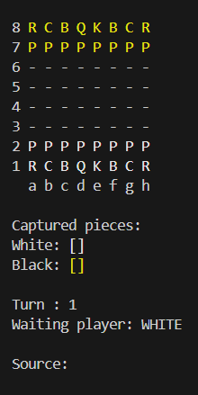

### Sobre o projeto

- O sistema desenvolvido emula uma partida de xadrez no terminal do computador;
- O sistema conta com todas as funções de um jogo de xadrez comum, como jogadas especiais e promoção de peças;
- O código foi desenvolvido em Java puro, durante meus estudos sobre orientação a objetos na linguagem.

### A interface

- Como citado, o jogo roda no terminal e tem essa aparência:

